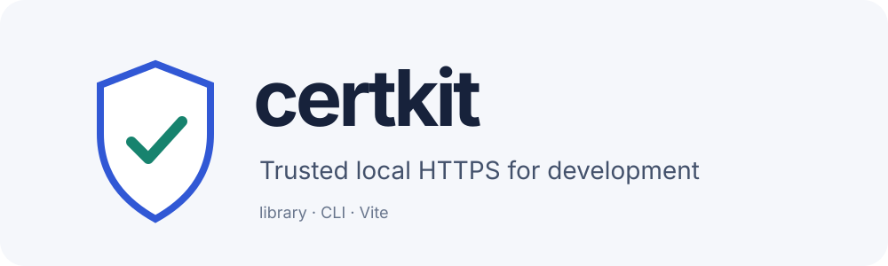
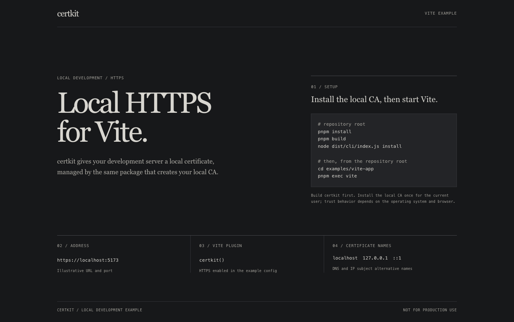

<p align="center">
  <picture>
    <source media="(prefers-color-scheme: dark)" srcset="assets/certkit-hero-dark.svg">
    <source media="(prefers-color-scheme: light)" srcset="assets/certkit-hero-light.svg">
    
  </picture>
</p>

<p align="center">
  <a href="https://github.com/code-kev/certkit/actions/workflows/ci.yml"></a>
  <a href="https://nodejs.org/"></a>
  <a href="https://vite.dev/"></a>
  <a href="LICENSE"></a>
</p>

**`mkcert`’s trusted local HTTPS experience as a normal npm package: no certkit runtime binary download, nothing to compile, and no OpenSSL executable required.**

certkit creates a private local certificate authority and leaf certificates in JavaScript, then installs that CA in supported local trust stores. Use it as a library, CLI, or Vite plugin. It makes no network calls. Linux browser trust needs the system `certutil` tool (package: `libnss3-tools` on Debian/Ubuntu, `nss-tools` on Fedora).

> certkit is in beta. `1.0.0-beta.2` is the current prerelease on npm's `beta` dist-tag, and the commands below install it as `certkit@beta`. Because npm assigned its required `latest` tag at the first publish and a prerelease does not move it, unqualified `npm install certkit` still resolves the first beta (`1.0.0-beta.1`) until a stable version is published.

## Why certkit

- **No runtime binary download.** Certificate generation uses Node.js WebCrypto and a JavaScript X.509 library.
- **One package for app code and local setup.** The API, CLI, and first-party Vite plugin share the same per-user CA.
- **Trust stays explicit.** `install`, `status`, and `uninstall` show which detected store or browser database accepted the CA.
- **No telemetry or phone-home.** Trust operations run on the local machine.

### Quick start

Requires Node.js **22.15.0 or newer**. Install the CA once for your user:

```sh
npx certkit@beta install
npx certkit@beta status
```

On Linux, automatic Chromium and Firefox NSS integration requires `certutil`. Install the OS package `libnss3-tools` (Debian/Ubuntu), `nss-tools` (Fedora), or the distribution’s NSS tools package first. `/etc/pki/nssdb` is manual-only in v1.

**Treat generated private keys as secrets.** Add both `*.pem` and `*-key.pem` to `.gitignore` before creating certificates:

```gitignore
*.pem
*-key.pem
```

The broad `*.pem` rule also ignores other PEM files in that repository; narrow it to generated names if the project intentionally tracks PEM certificates.

#### Library

```sh
npm install certkit@beta
```

```js
import { certificateFor } from 'certkit';
import { createServer } from 'node:https';

const { cert, key } = await certificateFor(['localhost', '127.0.0.1', '::1']);
createServer({ cert, key }, (request, response) => {
  response.end('Hello over trusted HTTPS');
}).listen(8443);
```

The library generates files in certkit’s CA directory and returns PEM strings; it never installs trust. Run `npx certkit@beta install` separately. The returned private key is sensitive.

#### Vite

```sh
npm install -D certkit@beta vite
```

```ts
// vite.config.ts
import { defineConfig } from 'vite';
import { certkit } from 'certkit/vite';

export default defineConfig({
  plugins: [certkit()],
  server: { https: {} },
});
```

Run `npx certkit@beta install` once before `vite`. HTTPS is opt-in: `server.https: {}` requests it. The plugin fails startup when all detected browser trust targets are untrusted, and warns about uncertain or untrusted targets. If no browser target is detected, trust remains uncertain.



This screenshot was rendered from the example over local HTTP with the certkit plugin disabled. It shows the page layout only; it does not verify HTTPS or browser trust.

#### CLI

```sh
npx certkit@beta create localhost 127.0.0.1 ::1
# localhost+2.pem and localhost+2-key.pem are written to the current directory
```

`create` does not install the CA. See the [CLI reference](docs/cli.md) for all commands, JSON shapes, exit codes, and file safety details.

### Important platform limits

- **Windows:** certkit installs only in the current user’s Root certificate store. An elevated shell, another user, Windows service, or application running as a different account does not inherit that user’s trust.
- **WSL:** Linux trust inside WSL does not make Windows browsers trust the CA. Install certkit in the Windows environment for Windows browsers.
- **Browser support:** detected NSS databases are handled individually. `cert8.db`-only legacy profiles are unsupported. `/etc/pki/nssdb` is status-only/manual in v1.
- **Node.js:** Node 22.15.0+ uses bundled roots by default; `--use-system-ca` adds OS roots on Windows, macOS, and Linux (Linux reads OpenSSL's default CA paths). See [Node trust](docs/node-trust.md) for details and CI/container recipes.

See the [trust matrix](docs/trust-matrix.md) for verification levels, platform versions, and pending coverage.

### Comparison (upstream documentation checked 2026-09-30)

| Project | Documented mechanism and scope |
| --- | --- |
| **certkit** | `1.0.0-beta.2` prerelease: JavaScript library, CLI, and Vite plugin; generates a per-user CA and leaf certs; installs in supported OS and NSS stores. Requires Node 22.15.0+. Linux NSS requires system `certutil`. |
| [mkcert](https://github.com/FiloSottile/mkcert) | Go command-line program; upstream documents installation via package manager, source build, or prebuilt binary; installs roots into OS, Firefox/Chromium NSS, and optional Java stores. Node recipe uses `NODE_EXTRA_CA_CERTS`. |
| [vite-plugin-mkcert](https://github.com/liuweiGL/vite-plugin-mkcert) | Vite plugin that uses the mkcert executable; upstream documents downloading/upgrading it, a configurable binary path, and proxy/download-source settings. Its README lists Node 22.19.0+. |
| [@vitejs/plugin-basic-ssl](https://github.com/vitejs/vite-plugin-basic-ssl) | Vite plugin that generates a self-signed, untrusted certificate; browsers show a warning/interstitial before access. |
| [devcert](https://github.com/davewasmer/devcert) | Its [upstream `package.json`](https://github.com/davewasmer/devcert/blob/master/package.json) is version 1.2.3; its README describes a JavaScript `certificateFor` API, OS keychain registration, and CA path/buffer options. certkit acknowledges devcert’s user-local CA-directory prior art; see [Coming from devcert?](docs/devcert-migration.md). |

## Security and project

- [Security policy and private reporting](SECURITY.md)
- [Trust matrix and verification status](docs/trust-matrix.md)
- [Node.js and CI trust recipes](docs/node-trust.md)
- [CLI reference](docs/cli.md)
- [Contributing](CONTRIBUTING.md) · [Code of Conduct](CODE_OF_CONDUCT.md) · [Changelog](CHANGELOG.md)
- [Apache-2.0 license](LICENSE)
