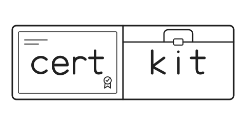

<p align="center">
  <picture>
    <source media="(prefers-color-scheme: dark)" srcset="assets/certkit-mark-dark.svg">
    
  </picture>
</p>

<p align="center">
  <strong>Trusted local HTTPS. One npm package.</strong><br>
  Certificate tools for your development servers.<br>
  JavaScript library · CLI · first-party Vite plugin
</p>

<p align="center">
  <a href="https://www.npmjs.com/package/certkit"></a>
  <a href="https://github.com/code-kev/certkit/actions/workflows/ci.yml"></a>
  <a href="https://nodejs.org/"></a>
  <a href="https://vite.dev/"></a>
  <a href="LICENSE"></a>
</p>

<p align="center">
  <a href="#quickstart">Quickstart</a> ·
  <a href="#vite">Vite</a> ·
  <a href="#library">Library</a> ·
  <a href="#cli">CLI</a> ·
  <a href="#documentation">Documentation</a>
</p>

certkit brings `mkcert`’s trusted local HTTPS experience to a normal npm package. It creates a private local certificate authority (CA), issues certificates for your development servers, and installs that CA in supported local trust stores.

- **JavaScript certificate generation.** Node.js WebCrypto and a JavaScript X.509 library. No certkit runtime binary download, nothing to compile, and no OpenSSL executable required.
- **One shared CA.** The library, CLI, and Vite plugin use the same per-user certificate authority.
- **Explicit trust.** `install`, `status`, and `uninstall` report results for each detected store or browser database.
- **Local operations.** No network calls, telemetry, or phone-home.

> [!NOTE]
> **certkit is in beta.** Prereleases publish under npm's `beta` dist-tag, so `certkit@beta` always resolves to the newest prerelease. `latest` follows the newest prerelease while it points to a prerelease, and stops once a stable release takes it, so prefer `certkit@beta` in scripts and CI.

## Quickstart

Requires **Node.js 22.15.0 or newer**. Install the CA once for your user, then check the detected trust targets:

On **Linux**, automatic Chromium and Firefox NSS integration requires the system `certutil` tool. Install `libnss3-tools` (Debian/Ubuntu), `nss-tools` (Fedora), or your distribution’s NSS tools package first. `/etc/pki/nssdb` is manual-only in v1.

```sh
npx certkit@beta install
npx certkit@beta status
```

**Keep generated private keys out of Git.** Add these rules to `.gitignore` before creating certificates:

```gitignore
*.pem
*-key.pem
```

The broad `*.pem` rule also ignores other PEM files in that repository; narrow it to generated names if the project intentionally tracks PEM certificates. Treat all generated private keys as secrets.

## Use certkit

Choose the entry point that fits your project. Each uses the CA from the setup above; certificate generation itself never installs trust.

| Your project | Start here |
| --- | --- |
| A Vite development server | [Vite plugin](#vite) — opt into HTTPS in your config. |
| A Node.js server or custom tooling | [Library](#library) — get certificate and private-key PEM strings. |
| A server that reads certificate files | [CLI](#cli) — write a certificate and key to disk. |

### Vite

Add trusted local HTTPS to a Vite 7 or 8 development server.

```sh
npm install -D certkit@beta vite
```

```ts
// vite.config.ts
import { defineConfig } from 'vite';
import { certkit } from 'certkit/vite';

export default defineConfig({
  plugins: [certkit()],
  server: { https: {} },
});
```

Run `npx certkit@beta install` once before starting Vite. HTTPS is opt-in: `server.https: {}` requests it. The plugin fails startup when all detected browser trust targets are untrusted, and warns about uncertain or untrusted targets. If no browser target is detected, trust remains uncertain.

Start the development server with `npx vite`, then open the HTTPS URL it prints.

[Try the Vite example](examples/vite-app) · [Check browser support](docs/trust-matrix.md)

### Library

Generate a certificate for a Node.js HTTPS server or your own tooling.

```sh
npm install certkit@beta
```

```js
// server.mjs
import { certificateFor } from 'certkit';
import { createServer } from 'node:https';

const { cert, key } = await certificateFor(['localhost', '127.0.0.1', '::1']);
createServer({ cert, key }, (request, response) => {
  response.end('Hello over trusted HTTPS');
}).listen(8443);
```

Save the example as `server.mjs`, run `node server.mjs`, and open `https://localhost:8443` in your browser.

The library generates files in certkit’s CA directory and returns PEM strings. It never installs trust; run `npx certkit@beta install` separately. The returned private key is sensitive.

[Node.js trust and CI recipes](docs/node-trust.md) · [Coming from devcert?](docs/devcert-migration.md)

### CLI

Write certificate files for a server that manages its own HTTPS configuration.

```sh
npx certkit@beta create localhost 127.0.0.1 ::1
# Writes localhost+2.pem and localhost+2-key.pem to the current directory.
```

`create` does not install the CA. Use `install` to add trust, `status` to inspect it, and `uninstall` to remove certkit’s CA.

[CLI reference](docs/cli.md) — all commands, JSON shapes, exit codes, and file safety details.

## Platform support

Trust depends on the operating system, browser, and account running your application.

| Environment | What to know |
| --- | --- |
| **macOS** | certkit installs in the current user’s login keychain. It does not write the System keychain. |
| **Linux** | certkit installs in supported system CA stores; browser NSS databases require `certutil`. See the [trust matrix](docs/trust-matrix.md) for distributions and observed results. |
| **Windows** | certkit installs only in the current user’s Root certificate store. Running an elevated shell does not change that target; other users, services, and applications under another account do not inherit the installing user’s trust. |
| **WSL** | Linux trust inside WSL does not make Windows browsers trust the CA. Install certkit in the Windows environment for Windows browsers. |
| **Browser NSS databases** | Detected databases are handled individually. `cert8.db`-only legacy profiles are unsupported. `/etc/pki/nssdb` is status-only/manual in v1. |
| **Node.js** | Node 22.15.0+ uses bundled roots by default; `--use-system-ca` adds OS roots on Windows, macOS, and Linux. Linux reads OpenSSL's default CA paths. See [Node trust](docs/node-trust.md) for details and CI/container recipes. |

See the [trust matrix](docs/trust-matrix.md) for verification levels, platform versions, and pending coverage.

<details>
<summary><strong>Compare certkit with other local HTTPS tools</strong></summary>

Upstream documentation checked 2026-09-30.

| Project | Documented mechanism and scope |
| --- | --- |
| **certkit** | prerelease: JavaScript library, CLI, and Vite plugin; generates a per-user CA and leaf certs; installs in supported OS and NSS stores. Requires Node 22.15.0+. Linux NSS requires system `certutil`. |
| [mkcert](https://github.com/FiloSottile/mkcert) | Go command-line program; upstream documents installation via package manager, source build, or prebuilt binary; installs roots into OS, Firefox/Chromium NSS, and optional Java stores. Node recipe uses `NODE_EXTRA_CA_CERTS`. |
| [vite-plugin-mkcert](https://github.com/liuweiGL/vite-plugin-mkcert) | Vite plugin that uses the mkcert executable; upstream documents downloading/upgrading it, a configurable binary path, and proxy/download-source settings. Its README lists Node 22.19.0+. |
| [@vitejs/plugin-basic-ssl](https://github.com/vitejs/vite-plugin-basic-ssl) | Vite plugin that generates a self-signed, untrusted certificate; browsers show a warning/interstitial before access. |
| [devcert](https://github.com/davewasmer/devcert) | Its [upstream `package.json`](https://github.com/davewasmer/devcert/blob/master/package.json) is version 1.2.3; its README describes a JavaScript `certificateFor` API, OS keychain registration, and CA path/buffer options. certkit acknowledges devcert’s user-local CA-directory prior art; see [Coming from devcert?](docs/devcert-migration.md). |

</details>

## Documentation

| Guide | Find out about |
| --- | --- |
| [CLI reference](docs/cli.md) | Commands, automation, JSON output, and safe file handling. |
| [Trust matrix](docs/trust-matrix.md) | Supported stores, verification status, and platform limits. |
| [Node.js trust](docs/node-trust.md) | Node clients, CI, and containers. |
| [Vite example](examples/vite-app) | A minimal app using the first-party plugin. |
| [devcert migration](docs/devcert-migration.md) | Moving an existing project to certkit. |
| [Security policy](SECURITY.md) | Security details and private vulnerability reporting. |

Questions and setup help: [Discussions](https://github.com/code-kev/certkit/discussions). Found a bug? [Open an issue](https://github.com/code-kev/certkit/issues).

[Contributing](CONTRIBUTING.md) · [Code of Conduct](CODE_OF_CONDUCT.md) · [Changelog](CHANGELOG.md) · [Apache-2.0 license](LICENSE)
